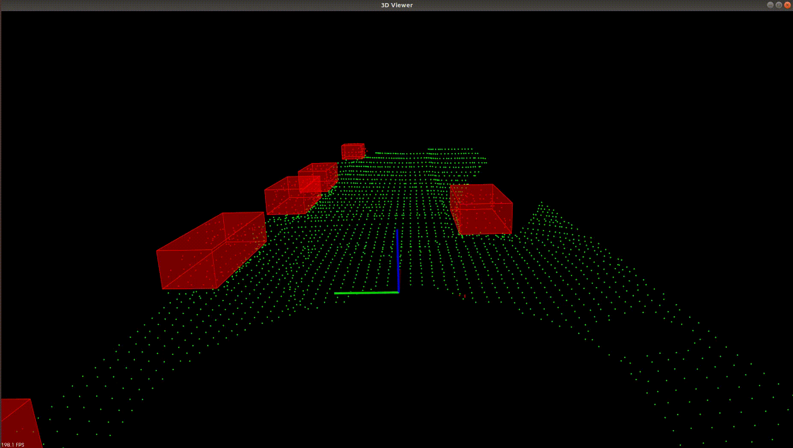

[](https://www.udacity.com/course/sensor-fusion-engineer-nanodegree--nd313)

# Udacity Nanodegree : Sensor Fusion 

## Project 1 : Lidar Obstacle Detection 



### Project Objective 

The objective of this project is to detect obstacles from lidar pointcloud recorded on a car.  

- **Working with PointCloud data** using [Point Cloud Library](https://pointclouds.org).
- **Segmenting road from obstacles** by fitting points to a plane model using RANSAC.
- **Clustering obstacle points together** using K-D Tree in Euclidean cluster extraction.
- **Fitting bounding boxes on clustered obtacles** for simpler tracking and collision avoidance.

Project pipeline :  
```
1. Load .pcd file
2. Downsample pointcloud using Voxel grid filtering.
3. Extract region of interest using Box filter.
4. Segment planar points using RANSAC.
5. Insert remaining non-planar points into a K-D Tree and Cluster them based on a distance tolerance (Euclidean cluster extraction).
6. Draw bounding boxes around objects.
7. Loop through .pcd files and stream results.

```

### Directory structure
```
.
├── CMakeLists.txt                        # Top level Cmake file
├── media                                 # Folder containing the screenshots of the results
│   ├── lidar_obstacleDet.mkv
│   ├── obstacleDetection.gif
├── README.md                             # Readme file for reference
└── src
    ├── environment.cpp                   # File to setup the environment
    ├── processPointClouds.cpp            # File containing actual implementation of segmentation, custering and IO
    ├── processPointClouds.h
    ├── quiz                              # Quiz folder containing implementation of KDtree and RANSAC
    │   ├── cluster
    │   │   ├── cluster.cpp
    │   │   ├── CMakeLists.txt
    │   │   └── kdtree.h
    │   └── ransac
    │       ├── CMakeLists.txt
    │       └── ransac2d.cpp
    ├── render                            # Package for data visualization
    │   ├── box.h
    │   ├── render.cpp
    │   └── render.h
    └── sensors
        ├── data
        │   └── pcd
        │       ├── data_1
        │       │   ├── *****.pcd
        │       ├── data_2
        │       │   ├── *****.pcd
        │       └── simpleHighway.pcd
        └── lidar.h

```

### How to run

#### 1. Clone the repository  
```
git clone https://github.com/Madhan-Sureshbabu/SFND_1_LidarObstacleDetection
```

#### 2. Dependencies 
```
PCL  
CMake
system
filesystem
iostream
serialization
chorono
time
atomic
regex
```

#### 3. Build the project
```
$ cd SFND_1_Lidar_Obstacle_Detection
$ mkdir build && cd build
$ cmake ..
$ make 
$ ./environment
```

